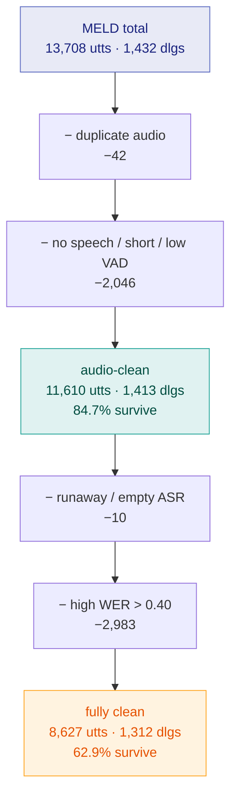

# MELD — Dataset Analysis

**Scope: methodology.** What the corpus contains, how it is measured, and what
each processing choice costs. Every figure was computed from the files on disk,
not quoted from a paper.

Decision rationale and alternatives rejected are in `DECISIONS.md`;
implementation history is in `CHANGE_RECORD.md`; failure analysis is in
`POSTMORTEMS.md`. This document does not repeat them.

**Provenance.** ASR is Voxtral-Mini-3B-2507 via vLLM 0.19.0, greedy decoding
(`temperature=0.0`, `max_tokens=200`), single-pass extraction
(`docs/CHANGE_RECORD.md` CR-003). VAD is Silero. Per-utterance table built by
`src/evaluation/build_wer_vad_table.py`, flagged by
`src/evaluation/analyse_wer_vad.py`, duplicates by an md5 scan. Raw outputs in
`results_new/mini/wer/`.

---

## 1. Composition

| | train | dev | test | total |
|---|---:|---:|---:|---:|
| utterances | 9,989 | 1,109 | 2,610 | **13,708** |
| dialogues | 1,038 | 114 | 280 | **1,432** |
| distinct speakers | 260 | 47 | 100 | — |
| seasons covered | 1–9 | 1–9 | 1–9 | 1–9 |

Utterances per dialogue: train mean 9.6, dev 9.7, test 9.3.

### Two properties of the split that constrain what can be claimed

**Splits are by dialogue, not by speaker.** All nine seasons appear in all three
splits, and the six principal *Friends* cast members appear throughout. So every
evaluation on MELD is **speaker-dependent**: the model has heard these voices in
training. Any acoustic result is therefore an upper bound relative to unseen
speakers, and this is precisely why a separate accent corpus
(`ylacombe/english_dialects`, 17,877 clips) is needed for the dialect-robustness
claim — it is the only speaker-independent evidence available here.

**Dialogue-level splitting is the right choice** and should be kept: utterances
inside one dialogue are contextually dependent, so splitting at utterance level
would leak context between train and test. The bc-LSTM depends on that context,
which makes the constraint binding rather than cosmetic.

---

## 2. Label distribution

| emotion | train | % | dev | % | test | % |
|---|---:|---:|---:|---:|---:|---:|
| neutral | 4,710 | 47.2 | 470 | 42.4 | 1,256 | 48.1 |
| joy | 1,743 | 17.4 | 163 | 14.7 | 402 | 15.4 |
| surprise | 1,205 | 12.1 | 150 | 13.5 | 281 | 10.8 |
| anger | 1,109 | 11.1 | 153 | 13.8 | 345 | 13.2 |
| sadness | 683 | 6.8 | 111 | 10.0 | 208 | 8.0 |
| disgust | 271 | 2.7 | 22 | 2.0 | 68 | 2.6 |
| fear | 268 | 2.7 | 40 | 3.6 | 50 | 1.9 |

**Imbalance is 17.6:1** (neutral : fear in train). Consequences:

- Accuracy is uninformative — predicting neutral everywhere scores 47–48%.
  Weighted F1 is the primary metric , with per-class F1 alongside.
- **dev has 22 disgust and 40 fear.** Model selection on dev is unreliable for
  those classes: one or two utterances moves per-class F1 by several points.
- **test has 50 fear.** A per-class F1 for fear on test rests on 50 examples;
  it is directional, not a measurement.

---

## 3. Audio characteristics

Measured from the decoded waveform (`ffmpeg` → 16 kHz mono), not the annotation.

| | train | dev | test |
|---|---:|---:|---:|
| mean duration | 3.14 s | 3.12 s | 3.40 s |
| median | 2.48 s | 2.45 s | 2.60 s |
| p10 / p90 | 1.00 / 6.36 s | 1.00 / 6.02 s | 1.04 / 6.27 s |
| min / max | 0.06 / 41.05 s | 0.06 / 28.54 s | 0.13 / **304.96 s** |
| under 1 s | 942 (9.4%) | 107 (9.7%) | 223 (8.5%) |
| under 0.5 s | 306 | 38 | 82 |
| over 30 s | 1 | 0 | 2 |

**Voice activity** (Silero, `speech_ratio` = speech samples ÷ total samples):

| | train | dev | test |
|---|---:|---:|---:|
| mean | 0.697 | 0.678 | 0.691 |
| median | 0.787 | 0.775 | 0.782 |
| **exactly 0.0** | 862 (8.6%) | 118 (10.6%) | 235 (9.0%) |
| under 0.20 | 950 (9.5%) | 130 (11.7%) | 254 (9.7%) |

Roughly **one utterance in eleven contains no detectable speech at all** while
carrying an emotion label. These are laughter, reaction shots, and music cues
that MELD annotated from the subtitle track.

Gold text is short: median 6 words in train, and 1-word utterances are common
(backchannels — `"Oh!"`, `"What?"`, `"Alright?"`). This matters for WER, because
a single error on a one-word reference is WER 1.0.

---

## 4. ASR quality

### Two normalisation policies, both reported

The original `compute_wer.py` used `jiwer.RemovePunctuation()`, which **deletes**
punctuation rather than separating on it. That produced two different behaviours
from one rule, neither chosen:

```
'KL-5'   -> 'kl5'     hyphen deleted, tokens merged
"don't"  -> 'dont'    apostrophe deleted, tokens merged
```

The first is wrong. An ASR output of `KL 5` against a gold of `KL-5` scored
**WER 2.0 on a one-word reference** — one substitution plus one insertion — for
a transcription that was not wrong. `src/evaluation/text_normalisation.py`
replaces this with two explicit endpoints:

| policy | rule |
|---|---|
| **EXACT** | no normalisation. Whitespace split, verbatim, case- and punctuation-sensitive. Embeds zero judgement calls. |
| **NORMALISED** | lowercase → delete apostrophes (no space) → replace all other punctuation **with a space** → collapse whitespace |

Ordering matters: apostrophes must be handled before the space substitution, or
`don't` becomes `don t`. The same transform object is passed to
`reference_transform` and `hypothesis_transform`, so asymmetry is structurally
impossible.

### Encoding defect in the reference text

MELD's CSVs are not UTF-8. The byte pair `C2 92` decodes to U+0092, a C1 control
character that was originally cp1252 `0x92` — a right single quote:

```
gold as read : 'Oh my God, he\x92s lost it.'
repaired     : "Oh my God, he's lost it."
```

**This affects 27% of utterances** (train 2,691 / dev 308 / test 742). Left
alone, every contraction in a quarter of the corpus scores as a substitution
against correctly-transcribed ASR. `repair_encoding()` maps these back before
either policy runs, and is applied to both sides (verified a no-op on ASR
output: 0 of 13,708 Voxtral strings contain any C1 byte).

### Corpus WER on train, by policy

| policy | corpus WER | median utt | mean utt | S | D | I |
|---|---:|---:|---:|---:|---:|---:|
| exact | 0.5055 | 0.4118 | 0.8866 | 19,169 | 6,784 | 14,193 |
| old (RemovePunctuation) | 0.3891 | 0.2500 | 0.7336 | 9,689 | 6,858 | 14,326 |
| **normalised** | **0.3812** | 0.2222 | 0.7121 | 9,312 | 7,474 | 13,938 |

The exact→normalised gap (0.51 → 0.38) is attributable to formatting alone. The
third row is the `RemovePunctuation` policy described above, retained for
comparison: it scores *higher* than the normalised policy because merging
hyphenated tokens manufactures errors that are not transcription errors.

### Corpus WER is not the mean of per-utterance WER

```
corpus WER  = Σ(sub + del + ins) / Σ(ref_words)
mean utt WER = per-row ratio, averaged
```

They differ by **2×** (0.38 vs 0.71) because a 1-word reference against a
176-word hallucination contributes 176.0 to the mean. **Report corpus WER.**
The per-utterance table carries `sub_norm`, `del_norm`, `ins_norm` and
`ref_words_norm` as separate columns precisely so corpus WER can be recomputed
over any subset by summing two columns.

---

## 5. Defect taxonomy

Flags are **additive, not exclusive** — a clip can be short *and* silent *and*
runaway. The report shows the overlap rather than forcing one category.

| flag | metric | threshold | rationale |
|---|---|---|---|
| `is_short` | decoded samples ÷ 16000 | < 1.0 s | 1 s ≈ 50 encoder frames at 50 Hz; below that the encoder has almost nothing to condition on |
| `is_low_vad` | Silero speech samples ÷ total | < 0.20 | matches the existing `vad_min_speech_ratio` in `mini.yaml`, so it is comparable to the current keep-lists |
| `is_no_speech` | same | = 0.0 | strict subset; no speech detected at all |
| `is_runaway` | `asr_words` vs `gold_words` | > 5× gold **and** ≥ 40 words | ratio alone fires on every 1-word gold; the absolute floor isolates genuine repetition loops |
| `is_dup_copy` | md5 of the `.mp4` | shares a hash with an earlier key | byte-identical file under a different label |
| `is_empty_asr` | `asr_words` | = 0 | |
| `is_high_wer` | `wer_normalised` | > 0.40 | mirrors `wer25_eval_wer40_train` already in `mini.yaml`, so counts are comparable to the existing keep-lists. Overridable via `--high_wer` |
| `is_wer_over_1` | `wer_normalised` | > 1.0 | more errors than reference words |

`is_high_wer` is the only **transcription-quality** gate; every other flag is an
**audio-property** gate. That distinction turns out to matter — see §5.3.

**These four constants are engineering choices, not derived quantities.** 1.0 s
and 0.20 are round numbers. `LOW_VAD = 0.20` was chosen to match the existing
`vad_min_speech_ratio: 0.20` in `mini.yaml` so results stay comparable to the
current keep-lists. `SHORT_SEC = 1.0` follows the encoder-frame argument above.
`RUNAWAY_RATIO = 5.0` / `MIN_WORDS = 40` were set from the observed gap between
normal outputs and repetition loops (see §6). `HIGH_WER = 0.40` is inherited
from the existing config policy. The WER threshold now has a sensitivity sweep
(§5.2); the audio thresholds do not yet, and still need one.

### Counts and corpus WER by class

**train (9,989)**

| class | count | % | corpus WER | median WER |
|---|---:|---:|---:|---:|
| ALL | 9,988 | 100.0 | 0.3461 | 0.1667 |
| short | 942 | 9.4 | 1.7818 | 0.2857 |
| low_vad | 950 | 9.5 | 1.4538 | 0.6667 |
| no_speech | 862 | 8.6 | 1.6786 | 1.0000 |
| dup_copy | 19 | 0.2 | 0.6832 | 0.5000 |
| runaway | 23 | 0.2 | 25.1837 | 24.2857 |
| empty_asr | 1 | 0.0 | 1.0000 | 1.0000 |
| wer_over_1 | 1,043 | 10.4 | 2.8465 | 2.3333 |
| **clean** | **8,469** | **84.8** | **0.2908** | 0.1667 |

**dev (1,109)**

| class | count | % | corpus WER | median WER |
|---|---:|---:|---:|---:|
| ALL | 1,109 | 100.0 | 0.3124 | 0.1667 |
| short | 107 | 9.7 | 2.5635 | 0.5000 |
| low_vad | 130 | 11.7 | 1.4665 | 0.5000 |
| no_speech | 118 | 10.6 | 1.7808 | 0.6667 |
| dup_copy | 1 | 0.1 | 1.2000 | 1.2000 |
| runaway | 2 | 0.2 | 31.5455 | 35.0000 |
| **clean** | **918** | **82.8** | **0.2392** | 0.1538 |

**test (2,610)**

| class | count | % | corpus WER | median WER |
|---|---:|---:|---:|---:|
| ALL | 2,610 | 100.0 | 0.3823 | 0.1667 |
| short | 223 | 8.5 | 3.5687 | 0.9000 |
| low_vad | 254 | 9.7 | 2.5596 | 1.0000 |
| no_speech | 235 | 9.0 | 2.8688 | 1.0000 |
| dup_copy | 22 | 0.8 | 2.8852 | 3.5000 |
| runaway | 13 | 0.5 | 31.2264 | 41.6667 |
| **clean** | **2,223** | **85.2** | **0.2691** | 0.1667 |

**Excluding defects moves corpus WER from 0.3823 → 0.2691 on test.** About 30%
of the reported error rate comes from ~15% of clips that are broken audio rather
than hard audio.

Note the median is unchanged (0.1667) between ALL and clean. The defects live
entirely in the tail; they do not shift the typical case.

### 5.2 WER threshold sensitivity

How many utterances a WER gate removes at each threshold, and how many of those
the **audio** flags (dup / short / low_vad / runaway) already catch.

**train (9,989)**

| WER > | removed | % | also audio-flagged | **only** WER | kept |
|---:|---:|---:|---:|---:|---:|
| 0.10 | 5,904 | 59.1 | 873 | 5,031 | 4,085 |
| 0.15 | 5,288 | 52.9 | 859 | 4,429 | 4,701 |
| 0.20 | 4,518 | 45.2 | 831 | 3,687 | 5,471 |
| 0.25 | 3,955 | 39.6 | 794 | 3,161 | 6,034 |
| 0.30 | 3,649 | 36.5 | 789 | 2,860 | 6,340 |
| **0.40** | **2,947** | **29.5** | **733** | **2,214** | **7,042** |
| 0.50 | 2,378 | 23.8 | 637 | 1,741 | 7,611 |
| 0.75 | 1,814 | 18.2 | 570 | 1,244 | 8,175 |
| 1.00 | 1,043 | 10.4 | 306 | 737 | 8,946 |


[reference](https://docs.nvidia.com/nemo/curator/curate-audio/process-data/quality-assessment/wer-filtering)

The proportion is stable across splits — at 0.40: train 29.5%, dev 28.2%,
test 29.2%. So the gate behaves consistently and is not an artefact of one split.

> **The `kept corpus WER` column in the raw JSON must not be reported as a
> result.** It falls from 0.35 to 0.13 as the threshold tightens, but only
> because everything above the threshold was removed. Selecting on a metric and
> then reporting that metric measures nothing. It is retained solely to show the
> shape of the distribution.

### 5.3 The WER gate removes a different population from the audio gates

At WER > 0.40 on train, 2,947 utterances are removed but only **733 were already
flagged by an audio property**. The other **2,214 have perfectly good audio and
a poor transcript.**

That distinction is consequential, because the two branches consume different
things:

| | audio-flagged clip | audio-good, text-bad clip |
|---|---|---|
| acoustic branch | broken input | **clean input, correct label** |
| text branch | broken input | garbage transcript = label noise |

Filtering those 2,214 from **both** branches discards good acoustic data in
order to protect the text branch.

**This is a candidate explanation for an unresolved result.** WER-filtering the
*training* data was previously worth only ±0.3 F1 points on the bc-LSTM — within
noise. If the filter simultaneously removes text noise (helping) and acoustic
signal (hurting), the two effects would roughly cancel, which is what was
observed. The experiment that separates them:

- **audio flags** (dup, short, no_speech) → apply to **both** branches; these
  clips are broken in both modalities
- **`is_high_wer`** → apply to the **text branch only**; the audio is fine

This has not been run. It is the most direct test available of whether the
earlier null result was a genuine null or two cancelling effects.

### 5.4 Attrition funnel — what survives, and what it costs in dialogues

Flags applied cumulatively in order of severity: dataset defects first
(unfixable), then audio properties, then transcription quality.

**train — 9,989 utterances / 1,038 dialogues**

| stage | removed | utts left | dialogues left | dialogues lost |
|---|---:|---:|---:|---:|
| START | — | 9,989 | 1,038 | — |
| − duplicate audio | 19 | 9,970 | 1,038 | 0 |
| − no speech (VAD = 0) | 860 | 9,110 | 1,023 | 15 |
| − short (< 1 s) | 546 | 8,564 | 1,023 | 15 |
| − low VAD (< 0.20) | 88 | 8,476 | 1,023 | 15 |
| − runaway ASR | 6 | 8,470 | 1,022 | 16 |
| − empty ASR | 1 | 8,469 | 1,022 | 16 |
| **− high WER (> 0.40)** | **2,213** | **6,256** | **951** | **87** |

**dev — 1,109 / 114**

| stage | removed | utts left | dialogues left | dialogues lost |
|---|---:|---:|---:|---:|
| START | — | 1,109 | 114 | — |
| − duplicate audio | 1 | 1,108 | 114 | 0 |
| − no speech | 118 | 990 | 114 | 0 |
| − short | 59 | 931 | 114 | 0 |
| − low VAD | 12 | 919 | 114 | 0 |
| − runaway | 0 | 919 | 114 | 0 |
| − empty ASR | 1 | 918 | 114 | 0 |
| **− high WER** | **221** | **697** | **109** | **5** |

**test — 2,610 / 280**

| stage | removed | utts left | dialogues left | dialogues lost |
|---|---:|---:|---:|---:|
| START | — | 2,610 | 280 | — |
| − duplicate audio | 22 | 2,588 | 280 | 0 |
| − no speech | 234 | 2,354 | 278 | 2 |
| − short | 110 | 2,244 | 278 | 2 |
| − low VAD | 19 | 2,225 | 277 | 3 |
| − runaway | 2 | 2,223 | 277 | 3 |
| − empty ASR | 0 | 2,223 | 277 | 3 |
| **− high WER** | **549** | **1,674** | **252** | **28** |



**Overall: 13,708 → 8,627 utterances (62.9%), 1,432 → 1,312 dialogues (91.6%).**

#### The dialogue cost is the part that matters

Utterance counts understate the damage, because the bc-LSTM consumes
*dialogues*, not utterances:

| | train | dev | test |
|---|---:|---:|---:|
| dialogues losing ≥ 1 utterance | **945 / 1,038 (91%)** | 101 / 114 (89%) | 248 / 280 (89%) |
| dialogues reduced to 1 utterance | 70 | 4 | 11 |
| dialogues lost entirely | 87 | 5 | 28 |

**Nine dialogues in ten are altered.** A dialogue that keeps 8 of 10 utterances
still counts as surviving, but the bc-LSTM now sees a conversation with holes in
it — and the two removed turns were context for the eight that remain.

**70 train dialogues collapse to a single utterance**, which means no context at
all: the bc-LSTM degenerates to an utterance-level classifier on those.

This is why the existing pipeline **masks labels rather than deleting
utterances** — a filtered utterance stays in the sequence as BiLSTM context and
only its loss is suppressed. That design choice was already correct, and this
table is the quantitative case for it. Any defect filter should follow the same
pattern: **drop from the loss, keep in the context.**

#### High WER dominates the funnel

The audio flags together remove 1,520 train utterances (15.2%). The single
`high_wer` gate removes 2,213 more — **more than all audio defects combined**,
and it is also what destroys 71 of the 87 lost dialogues.

Given §5.3 — that 2,214 of those have good audio and only bad text — applying
this gate to the acoustic branch is hard to justify. It is the gate that should
be branch-specific.

### Flag overlap

**test**

With `is_high_wer` included:

| combination | count |
|---|---:|
| clean | 1,674 |
| **high_wer only** | **549** |
| short \| low_vad \| no_speech \| high_wer | 80 |
| short | 71 |
| low_vad \| no_speech | 66 |
| low_vad \| no_speech \| high_wer | 55 |
| short \| high_wer | 39 |
| short \| low_vad \| no_speech | 22 |
| dup_copy \| high_wer | 21 |
| low_vad | 14 |
| short \| low_vad \| no_speech \| runaway \| high_wer | 11 |
| low_vad \| high_wer | 5 |
| runaway \| high_wer | 2 |
| dup_copy \| low_vad \| no_speech \| high_wer | 1 |

**549 clips are high-WER and nothing else** — the largest single defect
category in test, and the population §5.3 is about. Note also that 22 clips are
short/silent *without* being high-WER: bad audio does not always produce a bad
transcript.

**11 of 13 runaway cases are simultaneously short and silent.** That is the
hallucination pathway isolated. But `short` alone accounts for 110 clips that
transcribe fine — so duration by itself is not the predictor; **duration
combined with absent speech** is.

### Defect rate by emotion

Percentage of each class carrying at least one flag:

| emotion | train | dev | test |
|---|---:|---:|---:|
| neutral | 13.2 | 14.0 | 11.8 |
| joy | 18.2 | 18.4 | 20.9 |
| surprise | **22.4** | **24.0** | **22.8** |
| anger | 16.5 | 21.6 | 16.8 |
| sadness | 9.2 | 12.6 | 9.1 |
| disgust | 10.0 | 13.6 | 7.4 |
| fear | 14.2 | 22.5 | 18.0 |

**Defects are not uniformly distributed across labels.** Surprise is ~2× as
likely to be defective as sadness, consistently across all three splits. This is
mechanistically plausible — surprise is realised as short exclamations (`"Oh!"`,
`"What?!"`) which are exactly the sub-second clips that fail VAD and trigger
hallucination.

**Therefore any defect filter is also a label filter.** Removing defects removes
disproportionately more surprise than sadness, shifting the class distribution
the model trains on. This must be reported alongside any filtered result.

---

## 6. Duplicate audio — a dataset defect, not an ASR failure

MELD ships **byte-identical `.mp4` files for distinct utterances**:

```
dia71_utt4  md5=11f206cd229c66ad  1,134,545 bytes   gold "Joey, this is the awkward part."
dia71_utt5  md5=11f206cd229c66ad  1,134,545 bytes   gold "Oh!"
dia71_utt6  md5=11f206cd229c66ad  1,134,545 bytes   gold "Hey right!"
```

One file spans all three utterances; the segmentation never happened. Both
Voxtral and Whisper output the same text for all three — correctly, since they
are reading the same bytes.

| split | files | dup groups | redundant copies | % | largest group |
|---|---:|---:|---:|---:|---:|
| train | 9,989 | 19 | 19 | 0.19 | 2 |
| dev | 1,108 | 1 | 1 | 0.09 | 2 |
| **test** | 2,610 | 17 | **22** | **0.84** | **4** |

**Test is 4× more affected than train.** This is the most consequential finding
in this document, because duplicated clips carry *different emotion labels on
identical audio*. No acoustic model can separate them — it is an irreducible
error floor on acoustic-branch test performance, and it sits in the evaluation
set rather than the training set.

Two independent detectors agree and can be cross-checked:

- **md5 collision** — two utterances share a file byte-for-byte
- **duration mismatch** — `audio_duration_sec` ≫ `csv_duration_sec`, i.e. the
  file contains more than the utterance it is labelled with

### A distinct defect: broken annotations

`dia38_utt4` (test) has **304.96 s** of audio for a gold text of `"Oh it's
great, it's a role on..."`. Here `csv_duration_sec` **agrees** at 304.94 s — so
this is not a segmentation failure but a broken *annotation*: MELD's
StartTime/EndTime span five minutes of episode. `dia220_utt0` is 235 s with gold
`"What's that smell?"`.

These are caught incidentally by `is_runaway` (the ASR of five minutes of
dialogue vastly exceeds a one-line gold) but they are a different class with a
different cause. **An `is_overlong` flag is not yet implemented.**

---

## 7. Consequences for the pipeline

1. **Report corpus WER, not mean per-utterance WER.** They differ by 2×.
2. **Report both normalisation policies.** Their gap localises how much of the
   error rate is formatting rather than content.
3. **Excluding defects from training is defensible** — they are label noise.
4. **Excluding defects from test changes what is being measured.** The result is
   then not comparable to published MELD numbers. Both must be reported: full
   test set for comparability, clean test set for a ceiling estimate. Two scores
   computed over different-sized test sets are not comparable, and nothing in a
   results file reveals that unless the scored-utterance count is recorded
   beside the metric.
5. **A defect filter is a label filter.** Surprise loses ~2× more than sadness.
   The post-filter class distribution must be stated.
6. **Filter the two branches differently.** Audio defects break both modalities;
   high WER breaks only the text branch. Applying one gate to both discards
   usable acoustic data (§5.3).
7. **Never report a metric you filtered on.** `kept corpus WER` after a WER gate
   is circular.
6. **Duplicated test clips are an irreducible floor.** Quantify their
   contribution before attributing residual error to the model.

---

## 8. Limitations

- **The audio thresholds are unswept.** `SHORT_SEC`, `LOW_VAD` and
  `RUNAWAY_RATIO` are engineering choices supported by the mechanism arguments
  in §5, not by a sensitivity analysis. Only the WER threshold has one (§5.2).
- **The branch-specific filtering claim in §5.3 is a hypothesis.** That the WER
  gate should apply to the text branch alone follows from the measurement that
  2,214 removed clips have usable audio; it has not been tested empirically.
- **Over-long clips are not a distinct flag.** The broken-annotation class in
  §6 is caught only incidentally by `is_runaway`.
- **A single ASR system.** All WER figures come from Voxtral-Mini. Defects
  attributable to model capacity cannot be separated from defects attributable
  to the data without a second system.
- **VAD failures are not distinguishable from absent audio** in the output
  table: both leave `speech_ratio` blank. A row with `audio_present=1` and an
  empty `speech_ratio` indicates the former.

---

## Reproducing

```bash
# per-utterance table: decode, VAD, both WER policies
python3.12 src/evaluation/build_wer_vad_table.py \
    --config src/configs/extract_mini.yaml --splits train dev test

# defect flags + report
python3.12 src/evaluation/analyse_wer_vad.py \
    --config src/configs/extract_mini.yaml --splits train dev test
```

Outputs in `results_new/mini/wer/`:

| file | contents |
|---|---|
| `{split}_wer_vad.csv` | 30 columns, one row per utterance |
| `{split}_wer_vad_flagged.csv` | the above plus 10 defect columns |
| `{split}_defect_summary.json` | counts, corpus WER per class, overlaps |
| `defect_report.md` | all splits together |
| `/dcs/large/u5734759/meld_duplicate_audio.json` | md5 duplicate groups |
