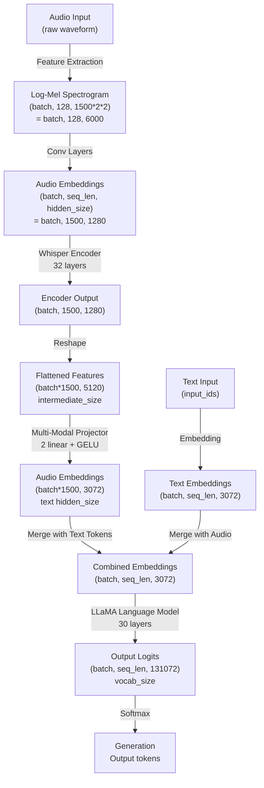

## **Voxtral Model Architecture Breakdown**



### **High-Level Concept**
Voxtral is a **multimodal speech-to-text model** that combines:
- **Audio Encoder** (Whisper-style) → processes audio to embeddings
- **Multi-Modal Projector** → adapts audio embeddings to text space
- **Language Model** (LLaMA) → generates text from combined audio+text embeddings

---

## **1. AUDIO ENCODER (VoxtralEncoder)**

### **Configuration Parameters** (from `VoxtralEncoderConfig`):
```
- vocab_size: 51,866
- hidden_size (d_model): 1,280
- intermediate_size (FFN): 5,120
- num_hidden_layers: 32 (encoder layers)
- num_attention_heads: 20
- num_mel_bins: 128
- max_source_positions: 1,500
- attention_dropout: 0.0
```

### **Architecture Components**:

**a) Convolutional Layers (Input Processing)**
```python
Conv1d(128 -> 1280, kernel=3, padding=1)  # Conv1
Conv1d(1280 -> 1280, kernel=3, stride=2, padding=1)  # Conv2
```
- **Input shape**: `(batch, 128, 6000)` — log-mel spectrogram with 128 frequency bins
- **After Conv1**: `(batch, 1280, 6000)`
- **After Conv2**: `(batch, 1280, 3000)` — stride=2 reduces temporal dimension
- **Purpose**: Convert raw spectrogram to rich embeddings, reduce sequence length

**b) Positional Embeddings**
```python
embed_positions = nn.Embedding(1500, 1280)  # Fixed, non-trainable
```
- **Shape**: `(1500, 1280)` — supports up to 1500 time steps
- **Purpose**: Add position information (Voxtral uses learned static positions, not rotary)

**c) Setup after convolutions:**
```
input -> gelu(conv1) -> gelu(conv2) -> permute(0, 2, 1)
Result shape: (batch, 1500, 1280)  # Now (seq_len, hidden_size)
Add positional embeddings and apply layer norm
```

**d) Transformer Stack (32 layers)**
Each `VoxtralEncoderLayer` contains:
```
Layer Norm -> Self-Attention (20 heads) -> Residual
   -> Layer Norm -> FFN(1280 -> 5120 -> 1280) -> Residual
```

**Design Choice**: Pre-norm architecture (LayerNorm before operations) vs post-norm - provides better stability during inference.

### **Encoder I/O Summary**:
| Aspect | Details |
|--------|---------|
| **Input** | `(batch, 128, 6000)` — mel-spectrogram |
| **Output** | `(batch, 1500, 1280)` — audio embeddings |
| **Max Audio** | 1500 positions × 2×2 conv stride = 6000 mel-time steps ≈ 30 seconds |
| **Frozen** | Encoder stays frozen during inference (only audio tower) |

---

## **2. MULTI-MODAL PROJECTOR (Adapter)**

This is the critical **bridge** between audio and text modalities:

```python
class VoxtralMultiModalProjector(nn.Module):
    self.linear_1 = nn.Linear(5120, 3072, bias=False)  # Audio -> Text space
    self.act = GELU
    self.linear_2 = nn.Linear(3072, 3072, bias=False)  # Refine representation
```

### **Design Choices**:

1. **Two-layer architecture**: 
   - First layer: maps from **audio intermediate size (5120) → text hidden size (3072)**
   - Second layer: **refines within text space (3072 → 3072)**
   - No bias terms on either layer (HuggingFace best practice for efficiency)

2. **GELU activation**: Non-linearity between layers for expresiveness

3. **Why needed?**
   - Audio encoder produces **1280-dim** embeddings via **5120-dim FFN** (intermediate)
   - Text model expects **3072-dim** embeddings
   - Direct size mismatch requires projection

### **Projector I/O**:
```
Input:  (batch*1500, 5120)  — flattened audio FFN outputs
  ↓ linear_1 + GELU
Intermediate: (batch*1500, 3072)
  ↓ linear_2
Output: (batch*1500, 3072)  — compatible with text embeddings
```

### **Token Replacement Mechanism** (in `VoxtralForConditionalGeneration.forward()`):
```python
# After text tokenization and audio projection:
audio_token_mask = (input_ids == 24).unsqueeze(-1)  # Token ID 24 = <|audio|>
inputs_embeds.masked_scatter(audio_token_mask, audio_embeds)
```
- **Design**: Audio tokens are **special tokens (ID=24)** in the vocabulary
- They get **replaced** with actual audio embeddings at runtime
- Allows interleaved audio+text sequences

---

## **3. TEXT MODEL (LLaMA Language Model)**

### **Configuration** (from `VoxtralConfig._default_text_config_kwargs`):
```
- model_type: "llama"
- vocab_size: 131,072
- hidden_size: 3,072
- intermediate_size (FFN): 8,192
- num_hidden_layers: 30
- num_key_value_heads: 8 (multi-query attention)
- max_position_embeddings: 131,072
- rope_theta: 100,000,000 (rotary embeddings)
- head_dim: 128
- use_cache: True (KV-cache for inference)
```

### **I/O**:
| Aspect | Details |
|--------|---------|
| **Input** | Combined embeddings: `(batch, seq_len, 3072)` — audio+text|
| **Output** | Logits: `(batch, seq_len, 131072)` — probabilities over vocab |
| **Purpose** | Decode combined modality context into natural language |

---

## **4. FULL MODEL FLOW (VoxtralForConditionalGeneration)**

### **Forward Pass Sequence**:

```
Step 1: Get input_ids and input_features
   input_ids: (batch, text_len)
   input_features: (batch, 128, 6000)

Step 2: Embed text tokens
   text_embeds = embedding_layer(input_ids)  # (batch, text_len, 3072)

Step 3: Process audio
   audio_outputs = audio_tower(input_features)  # (batch, 1500, 1280)
   audio_hidden = audio_outputs.last_hidden_state
   
Step 4: Project audio to text space
   audio_hidden = reshape  # (batch*1500, 1280) -> (batch*1500, 5120) via FFN
   audio_embeds = projector(audio_hidden)  # (batch*1500, 3072)
   
Step 5: Merge audio into text embeddings
   audio_token_mask = (input_ids == 24).unsqueeze(-1)  # Find <|audio|> tokens
   combined_embeds = inputs_embeds.masked_scatter(mask, audio_embeds)
   
Step 6: Generate with language model
   logits = language_model(
       inputs_embeds=combined_embeds,
       attention_mask=attention_mask,
       use_cache=True  # KV-caching for efficiency
   )
   return logits
```

---

## **5. DATA SHAPES THROUGHOUT PIPELINE**

```
AUDIO BRANCH:
  Raw audio (30s @ 16kHz): (1, 480,000) samples
  ↓ Feature extraction (Whisper processor)
  Log-mel spectrogram: (batch, 128, 6000)
  ↓ Conv1d(kernel=3): (batch, 1280, 6000)
  ↓ Conv1d(kernel=3, stride=2): (batch, 1280, 3000)
  ↓ Permute: (batch, 3000, 1280)
  ↓ Padding/Pooling(?): (batch, 1500, 1280)
  ↓ 32 Transformer layers: (batch, 1500, 1280)
  ↓ Reshape for projection: (batch*1500, 5120) [via FFN internal]
  ↓ Projector: (batch*1500, 3072)
  ↓ Reshape back: (batch, 1500, 3072)

TEXT BRANCH:
  Input tokens: (batch, text_len)
  ↓ Embedding: (batch, text_len, 3072)

COMBINATION:
  Merged: (batch, text_len + 1500, 3072) [roughly]
  ↓ 30 LLaMA layers: (batch, all_len, 3072)
  ↓ Projection to vocab: (batch, all_len, 131072)
  ↓ Argmax for tokens: (batch, all_len) [discrete IDs]
```

---

## **6. KEY DESIGN CHOICES**

| Choice | Rationale |
|--------|-----------|
| **Frozen Audio Encoder** | Whisper pre-training provides excellent speech representations; no need to fine-tune |
| **Two-layer Projector** | Provides non-linear mapping while keeping parameter count low; GELU adds expressiveness |
| **Token-based Merging** | Allows flexible audio+text sequences; clean separation via token ID 24 |
| **No Audio Attention Mask** | Silence is ignored naturally; explicit masking unnecessary |
| **Reshape in Projector** | `(batch, 1500, 1280)` → `(batch*1500, 5120)` → project → reshape back for batching efficiency |
| **LLaMA as Decoder** | Proven strong language model; handles knowledge grounding + generation |
| **KV-Cache Support** | Critical for efficient inference with long audio+text context |
| **Max 131K vocab** | Supports multiple languages; larger than typical 32K LLM vocab |

---

## **7. PROCESSOR LAYER** (Input Preparation)

The VoxtralProcessor handles:
- **Audio loading**: MP3, WAV, and base64 formats
- **Feature extraction**: Converts raw audio → mel-spectrograms
- **Chat template**: Manages `<|audio|>` token placement in conversations
- **Tokenization**: Text → token IDs using MistralCommonTokenizer

**Default Settings**:
```python
"audio_kwargs": {
    "sampling_rate": 16000,
    "padding": True,
    "pad_to_multiple_of": 480000,  # Pad to 30-sec multiples
    "max_source_positions": 3000,  # Allows 2x longer audio in processor
}
```

---

## **Summary Table**

| Component | Input | Output | Params (M) | Role |
|-----------|-------|--------|-----------|------|
| **Convolutional Layers** | (B, 128, 6000) | (B, 1280, 3000) | ~0.5M | Spectro→embeddings |
| **Positional Embed** | Position IDs | (1500, 1280) | ~1.9M | Position information |
| **Transformer Encoder** | (B, 1500, 1280) | (B, 1500, 1280) | ~150M | Audio understanding |
| **Multi-Modal Projector** | (B*1500, 5120) | (B*1500, 3072) | ~16M | Cross-modal bridge |
| **LLaMA Decoder** | (B, seq, 3072) | (B, seq, 131K) | **~3.2B** | Generation |
| **Total** | - | - | **~3.37B** | - |

The **~3B parameters** make this lightweight compared to 7B/13B LLMs while adding audio understanding!s


